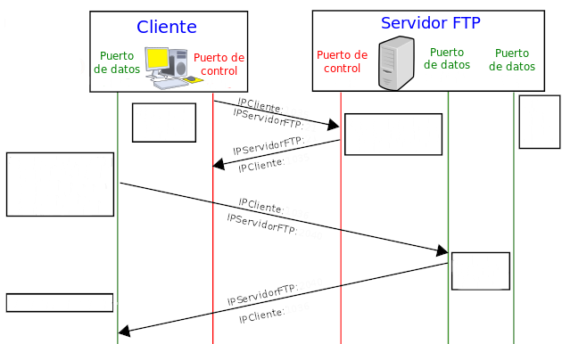

# Actividad FTP4

Realiza los siguientes ejercicios.

1. Nombra los modos de conexión del cliente al servidor FTP que existen.

1. ¿En qué modo el cliente envía un comando **PASV** para establecer conexión con el servidor? ¿Y cuál
utiliza el comando **PORT**?

1. Uno de estos modos tiene un problema de seguridad, ya que el cliente tiene que aceptar cualquier
conexión de entrada en un puerto mayor a 1024. ¿De qué modo se trata?

1. Independientemente del modo, ¿A qué puerto se dirige el cliente al servidor?

1. Investiga como cambiar el modo de conexión en el cliente FTP **FileZilla**.

1. La siguiente imagen está incompleta. Completa la imagen indicando de qué modo se trata e indica los mensajes que se envían entre Cliente y Servidor. El puerto de control del servidor es el 21, el puerto de datos es 2040. El puerto de datos del cliente es 1038 y el puerto de control es de 1037.

