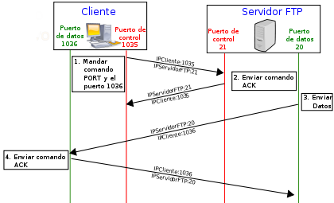

# ACTIVIDADES RESUELTAS FTP4

**1. ¿Que significan las siglas **FTP**?**

 RE:File Transfer Protocol o Protocolo de transferencia de ficheros

**2. ¿En qué consiste el protocolo FTP?**

RE:Para la transferencia de archivos a través de internet, del mismo modo que Dropbox o Google Drive

**3. Existen dos modos de conexión al servidor FTP.Indica cuales son.**

RE:Modo Activo y Pasivo

**4. ¿Por qué existen dos modos de conexión?**
Al principio solo existía el modo activo, pero al tener graves problemas de seguridad al tener que aceptar peticiones del servidor FTP desde un puerto superior al 1024, se acabó desarrollando el modo pasivo.

**5. ¿En qué modo de conexión el cliente envía un comando **PASV** para establecer conexión con el servidor? ¿Y cuál
utiliza el comando **PORT**?**

RE: En el modo pasivo se utiliza el comando PASV y en el modo activo se utiliza el comando PORT

**6. Indica a que modo pertenece la siguiente imagen:**

RE:Pertenece al modo activo, una razón para saber que el modo es activo es que el cliente envía un comando PORT para esteblecer conexión.

**7. Di 3 ejemplos de clientes FTP.**

RE:Asuk PHP FTP
Weeble File Manager
FileZilla
net2ftp
WebDrive
Web-Ftp
Jambai FTP
ftp4net
PHP FTP Client

**Hay bastantes clientes, cualquiera de estos es válido, además de ser los más conocidos**

**8. Nombra los dos tipos de transferencia de archivos que existen en el protocolo FTP e indica sus características.**
RE:Binario y ASCII.

ASCII: solo para archivos que contienen carácteres imprimibles

Binario:Se utiliza en archivos de audio, imágenes, archivos comprimidos...
